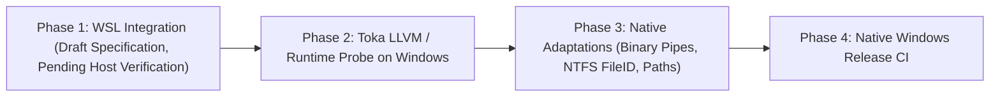

# Windows & WSL Support Feasibility Study for trg

- **Author:** trg Architecture Working Group
- **Date:** 2026-09-07
- **Status:** PROPOSED / EXPLORATORY RESEARCH (Candidate Design - Not Yet Implemented)
- **Document Path:** `docs/research/windows_and_wsl_feasibility.md`

---

## 1. Executive Summary & Phased Strategy

As `trg` solidifies its role as a high-performance universal search engine and Agent/MCP code retrieval substrate, expanding availability to Windows environments is an important roadmap consideration. However, platform support cannot be declared complete without empirical validation on physical Windows hosts.

We adopt a **strictly phased, evidence-driven exploration strategy**:



- **Phase 1 (WSL Integration - Configuration Draft)**: Document and explore the feasibility of running `trg` in Windows Subsystem for Linux (WSL). Labeled strictly as a configuration draft pending empirical measurement of cross-boundary I/O and process lifecycle on physical Windows hardware.
- **Phase 2 (Toka LLVM & Runtime Probe)**: Empirically evaluate Toka's native compiler backend (`tokac` LLVM IR / object emitter and `--target` interfaces) and `libtoka` runtime dependencies on Windows without source code changes to `trg`.
- **Phase 3 (Native Core Adaptations - Candidate Design)**: Architectural design for native Windows standard I/O (binary pipe mode), file identity canonicalization (NTFS file ID instead of case-folding), and long-path handling.
- **Phase 4 (Native Windows CI & Packaging)**: Future integration into GitHub Actions once Phases 2 and 3 succeed.

---

## 2. Phase 1: WSL Integration (Configuration Draft, Pending Host Verification)

> [!NOTE]
> This section represents a configuration specification and design proposal. It has not been benchmarked on physical Windows hardware and does not constitute certified platform support.

### 2.1 Proposed Operational Model
WSL 2 provides a Linux kernel environment capable of running Linux `x86_64` binaries. In theory, `trg-linux-x64` could execute inside WSL without re-compilation.

### 2.2 Unverified Filesystem Boundaries & Latency Considerations
1. **Linux Native Filesystem (`/home/...`, ext4)**:
   - Expected to behave similarly to Linux, but requires empirical validation of chunked memory-mapped file access.
2. **Windows Host Mounts (`/mnt/c/...`, 9P / virtio-fs)**:
   - Host filesystem access across the 9P / virtio-fs virtualization boundary is historically subject to significant throughput reduction and metadata translation latency.
   - Streaming memory scaling and long-line scaling contracts must be empirically remeasured across `/mnt/c/` before any production performance claims can be established.

### 2.3 Proposed Agent & MCP Bridge Configuration
Windows-hosted IDEs and agent sidecars (e.g. VS Code, Antigravity) could potentially spawn `trg --mcp` inside WSL via stdio redirection:
```json
{
  "mcpServers": {
    "trg": {
      "command": "wsl.exe",
      "args": [
        "--distribution", "Ubuntu",
        "--exec", "/usr/local/bin/trg", "--mcp"
      ]
    }
  }
}
```
*Pending Verification Items*:
- Process cleanup and orphan reaper behavior when Windows terminates `wsl.exe`.
- Stdio buffering and latency under continuous JSON-RPC streaming.

---

## 3. Phase 2: Native Windows Feasibility & Architectural Constraints

Native Windows support introduces three fundamental system-level divergence points that must be investigated as candidate designs:

```
+-------------------------------------------------------------------------------+
| Native Windows Platform Challenges (Exploratory Analysis)                     |
+-----------------------------------+-------------------------------------------+
| 1. Compiler Toolchain & Runtime   | Toka LLVM / object target & libtoka shims |
| 2. Filesystem & Path Semantics    | No blanket case-folding; NTFS FileID      |
| 3. Standard I/O & Encoding        | Console CP vs Redirected Binary Pipes     |
+-----------------------------------+-------------------------------------------+
```

---

### 3.1 Toka Compiler Backend & Runtime Toolchain Status

`trg` is compiled using the official Toka compiler (`tokac`).
- **Compiler Architecture**:
  - Toka 1.0.0-rc.11 provides direct LLVM IR emission, native object code generation, and `--target` triple interfaces (e.g. `x86_64-unknown-linux-gnu`, `aarch64-apple-darwin`). It does not use a legacy C code transpilation pipeline.
- **Probe Requirements on Windows**:
  - Validate `tokac` code generation against Windows target triples (e.g. `x86_64-pc-windows-gnu` via MinGW-w64 or `x86_64-pc-windows-msvc`).
  - Audit `libtoka` runtime dependencies for POSIX-only headers and syscalls (such as `<sys/resource.h>`, `<unistd.h>`, `<dirent.h>`, `wait4`, `fork`, and signal handling).
  - Test linkage against Windows C Runtime (`ucrt` / `msvcrt`) and kernel libraries.
- **Action**: Milestone M2 requires an isolated probe project compiling a minimal Toka program targeting Windows to assess backend readiness before opening any feature branch in `trg`.

---

### 3.2 Filesystem Semantics & Rejection of Blanket Case-Folding

#### The Flawed Assumption
A common naive assumption is that Windows paths are universally case-insensitive, leading developers to lowercase or case-fold paths during file interning and deduplication.

#### Why Blanket Case-Folding Is Rejected
1. **NTFS Per-Directory Case Sensitivity**: Starting with Windows 10 (version 1803), NTFS supports per-directory case sensitivity configured via `fsutil.exe file setCaseSensitiveInfo <dir> enable` or programmatic directory flags (`FILE_FLAG_POSIX_SEMANTICS`). Inside such directories, `File.txt` and `file.txt` are distinct files.
2. **WSL / Cross-Platform Mounts**: Files created by WSL or POSIX tools on NTFS frequently share the same name with different casings.
3. **Information Loss**: Case-folding alters the user's explicit path representation in CLI outputs and structured JSON payloads, breaking downstream editor hydration.

#### Candidate Path & File Identity Design
Instead of string-based case-folding:
- **Canonical File Identity**: In POSIX, file identity is `(st_dev, st_ino)`. On Windows, file identity must be retrieved via `GetFileInformationByHandleEx` with `FileIdInfo` (`FILE_ID_INFO`), which returns a 128-bit unique file ID and volume serial number.
- **Canonical Path Normalization**: Resolve paths using `GetFinalPathNameByHandleW` with `VOLUME_NAME_DOS`, which returns the exact case-preserving canonical filesystem path.
- **Path Separators**: Accept both `/` and `\` uniformly across argument parsing and glob matching; normalize internally to `/` for cross-platform glob compatibility.
- **Extended Path Length**: Prepend `\\?\` prefix when converting relative paths to absolute paths to support paths exceeding `MAX_PATH` (260 characters).

---

### 3.3 Standard I/O: Console Code Page vs MCP Binary Pipe Mode

Windows handles console output and redirected pipes through entirely distinct code paths in the C Runtime (CRT). A failure to separate them causes severe data corruption:

```
[trg Process] ---> stdout
                      |
                      +---> If Isatty (Console)  ===> SetConsoleOutputCP(CP_UTF8)
                      |
                      +---> If Redirected / Pipe ===> _setmode(_fileno(stdout), _O_BINARY)
                                                      (NO CRLF TRANSLATION!)
```

#### 1. Interactive Console Screen Buffers
- When outputting directly to a Windows Terminal or `cmd.exe` console, Windows defaults to a legacy OEM code page (e.g., CP437 or CP936).
- **Remedy**: `SetConsoleOutputCP(CP_UTF8)` sets the console screen buffer to decode UTF-8 bytes correctly for interactive display.

#### 2. Redirected Standard Streams & MCP Pipes
- When `trg` is spawned as a subprocess with redirected pipes (e.g., `trg --mcp` or `trg ... | grep`), `SetConsoleOutputCP` has **no effect**.
- The Windows CRT defaults standard file descriptors (`stdin`, `stdout`, `stderr`) to **Text Mode (`_O_TEXT`)**.
- In Text Mode, every `\n` byte written to `stdout` is automatically expanded by the runtime into `\r\n` (CRLF).
- **Impact on MCP & Budgets**:
  - `trg_view` and `trg_search` calculate exact UTF-8 byte budgets (e.g., `max_result_bytes: 800`). Automatic `\n` $\to$ `\r\n` injection expands the serialized JSON payload after serialization, violating the hard byte contract!
  - JSON-RPC protocol framing and JSON parsers in agents can fail or desynchronize on unintended byte counts.
- **Mandatory Remedy**:
  When launching in MCP mode or stream mode, `trg` must explicitly configure binary mode:
  ```c
  #ifdef _WIN32
  _setmode(_fileno(stdin), _O_BINARY);
  _setmode(_fileno(stdout), _O_BINARY);
  #endif
  ```
  This guarantees that bytes emitted by Toka's string serializer are transmitted across IPC pipes with 100% byte-for-byte fidelity.

---

### 3.4 Directory Traversal & Scanner Abstraction

`trg` currently utilizes POSIX `libc_opendir` / `libc_readdir` in `src/walker.tk`.
- On Windows, directory traversal should migrate to either:
  1. A minimal POSIX wrapper layer provided by MinGW-w64 (`dirent.h`), or
  2. A native Win32 abstraction using `FindFirstFileW` / `FindNextFileW` for maximum performance and native reparse point (symlink/junction) handling.
- Reparse points (`IO_REPARSE_TAG_MOUNT_POINT`, `IO_REPARSE_TAG_SYMLINK`) must respect `trg`'s `--follow` policy without infinite recursion.

---

## 4. Feasibility Roadmap & Recommendation

| Milestone | Phase | Deliverables | Status |
| :--- | :--- | :--- | :---: |
| **M1: WSL Integration** | Phase 1 | Documented configuration draft; pending physical host benchmark and process lifecycle verification. | **Draft / Unverified** |
| **M2: Toka Windows Probe** | Phase 2 | Standalone probe evaluating `tokac` LLVM codegen and `libtoka` runtime linking on Windows. | **Pre-requisite Research** |
| **M3: Native Windows Layer** | Phase 3 | `_O_BINARY` pipe mode, `FILE_ID_INFO` interning, Win32 directory walker candidate implementation. | **Candidate Design** |
| **M4: Native Windows CI** | Phase 4 | `windows-latest` GitHub Actions runner executing all qualification and matrix suites. | **Future Roadmap** |

### Immediate Recommendation
1. Treat Phase 1 (WSL) strictly as a draft configuration template; do not advertise WSL support as complete or benchmarked until physical host test evidence is gathered.
2. Advance Milestone M2 (Toka compiler LLVM and runtime probe) independently; native platform porting will not block current patch maintenance or general search roadmap items.
