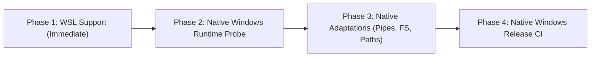

# Windows & WSL Support Feasibility Study for trg

**Author:** trg Architecture Working Group  
**Date:** 2026-09-07  
**Status:** PROPOSED / RESEARCH PHASE  
**Document Path:** `docs/research/windows_and_wsl_feasibility.md`  

---

## 1. Executive Summary & Phased Strategy

As `trg` solidifies its role as a high-performance universal search engine and Agent/MCP code retrieval substrate, expanding availability to Windows environments is a logical roadmap objective. However, a premature rush to native Windows porting risks introducing platform-specific workarounds, architectural regressions, and unverified assumptions.

We adopt a **strictly phased, evidence-driven approach**:



- **Phase 1 (WSL Validation & Support)**: Provide immediate, robust support for Windows developers and agents via Windows Subsystem for Linux (WSL). Requires zero compiler or code changes; establishes MCP bridge patterns for Windows IDEs.
- **Phase 2 (Native Windows Runtime Probe)**: Empirically validate Toka compiler support on Windows (via MinGW-w64 / MSYS2 or LLVM/Clang) using a minimal standalone runtime probe before making any changes to `trg` source code.
- **Phase 3 (Native Core Adaptations)**: Implement native Windows standard I/O (binary pipe mode), file identity canonicalization (NTFS file ID instead of case-folding), and long-path handling.
- **Phase 4 (Native Packaging & CI)**: Integrate native Windows runners into GitHub Actions CI matrix.

---

## 2. Phase 1: WSL Support (Zero-Cost Immediate Capability)

### 2.1 Operational Architecture
WSL 2 provides a full Linux kernel environment with direct binary compatibility for Linux `x86_64` (and `aarch64` under Windows on ARM). The certified Linux release binary (`trg-0.14.0-linux-x64`) executes directly in WSL without re-compilation.

### 2.2 Filesystem Boundaries & Performance
1. **Linux Native Filesystem (`/home/...`, ext4)**: Full performance parity with native Linux. Ideal for repositories cloned directly within the WSL distribution.
2. **Windows Mounts (`/mnt/c/...`, 9P / virtio-fs)**:
   - Cross-boundary I/O over `/mnt/c/` incurs filesystem virtualization overhead.
   - For optimal streaming performance, agents running in WSL should recommend hosting active development workspaces on the WSL native filesystem or configure `trg` chunk-reading buffers appropriately.

### 2.3 Agent & MCP Integration over WSL
Windows-hosted IDEs and agent sidecars (e.g., Antigravity, VS Code, Cursor) can communicate with `trg --mcp` running inside WSL via standard stdio redirection:
```json
{
  "mcpServers": {
    "trg": {
      "command": "wsl.exe",
      "args": [
        "--distribution", "Ubuntu",
        "--exec", "/usr/local/bin/trg", "--mcp"
      ]
    }
  }
}
```
Standard input and output are piped through `wsl.exe` as raw byte streams, preserving JSON-RPC message framing and byte budgets.

---

## 3. Phase 2: Native Windows Feasibility & Architectural Constraints

Native Windows support introduces three fundamental system-level divergence points that must be addressed methodically:

```
+-------------------------------------------------------------------------------+
| Native Windows Platform Challenges                                           |
+-----------------------------------+-------------------------------------------+
| 1. Compiler Toolchain & Runtime   | Toka compiler target status on Windows    |
| 2. Filesystem & Path Semantics    | No blanket case-folding; NTFS FileID      |
| 3. Standard I/O & Encoding        | Console CP vs Redirected Binary Pipes     |
+-----------------------------------+-------------------------------------------+
```

---

### 3.1 Toka Compiler & Runtime Toolchain Status

`trg` is written entirely in Toka (compiled via `tokac`).
- **Current Support**: Toka 1.0.0-rc.11 officially targets POSIX environments (macOS Darwin and Linux glibc/musl) via standard C code generation and LLVM linkage.
- **Windows Porting Requirement**: Before writing native Windows code in `trg`, the Toka toolchain itself must be probed on Windows:
  - Can `tokac` emit valid C code that compiles cleanly under `gcc` (MinGW-w64 / MSYS2) or `clang`?
  - Does Toka's runtime library (`libtoka`) compile without POSIX-only headers (such as `<sys/resource.h>`, `<unistd.h>`, `<dirent.h>`)?
- **Action**: Deliverable 2 of the roadmap must be a standalone "Toka Runtime Probe on Windows" script that compiles a minimal 20-line Toka test binary on Windows before committing `trg` changes.

---

### 3.2 Filesystem Semantics & Why Blanket Case-Folding Is Rejected

#### The Flawed Assumption
A common naive assumption is that Windows paths are universally case-insensitive, leading developers to lowercase or case-fold paths during interning and deduplication.

#### Why Blanket Case-Folding Is Flawed
1. **NTFS Per-Directory Case Sensitivity**: Starting with Windows 10 (version 1803), NTFS supports per-directory case sensitivity configured via `fsutil.exe file setCaseSensitiveInfo <dir> enable` or programmatic directory flags (`FILE_FLAG_POSIX_SEMANTICS`). Inside such directories, `File.txt` and `file.txt` are distinct files.
2. **WSL / Cross-Platform Mounts**: Files created by WSL or POSIX tools on NTFS frequently share the same name with different casings.
3. **Information Loss**: Case-folding alters the user's explicit path representation in CLI outputs and structured JSON payloads, breaking downstream editor hydration.

#### The Correct Path & File Identity Strategy
Instead of string-based case-folding:
- **Canonical File Identity**: In POSIX, file identity is `(st_dev, st_ino)`. On Windows, file identity must be retrieved via `GetFileInformationByHandleEx` with `FileIdInfo` (`FILE_ID_INFO`), which returns a 128-bit unique file ID and volume serial number.
- **Canonical Path Normalization**: Resolve paths using `GetFinalPathNameByHandleW` with `VOLUME_NAME_DOS`, which returns the exact case-preserving canonical filesystem path.
- **Path Separators**: Accept both `/` and `\` uniformly across argument parsing and glob matching; normalize internally to `/` for cross-platform glob compatibility.
- **Extended Path Length**: Prepend `\\?\` prefix when converting relative paths to absolute paths to support paths exceeding `MAX_PATH` (260 characters).

---

### 3.3 Standard I/O: Console Code Page vs MCP Binary Pipe Mode

Windows handles console output and redirected pipes through entirely distinct code paths in the C Runtime (CRT). A failure to separate them causes severe data corruption:

```
[trg Process] ---> stdout
                      |
                      +---> If Isatty (Console)  ===> SetConsoleOutputCP(CP_UTF8)
                      |
                      +---> If Redirected / Pipe ===> _setmode(_fileno(stdout), _O_BINARY)
                                                      (NO CRLF TRANSLATION!)
```

#### 1. Interactive Console Screen Buffers
- When outputting directly to a Windows Terminal or `cmd.exe` console, Windows defaults to a legacy OEM code page (e.g., CP437 or CP936).
- **Remedy**: `SetConsoleOutputCP(CP_UTF8)` sets the console screen buffer to decode UTF-8 bytes correctly for interactive display.

#### 2. Redirected Standard Streams & MCP Pipes
- When `trg` is spawned as a subprocess with redirected pipes (e.g., `trg --mcp` or `trg ... | grep`), `SetConsoleOutputCP` has **no effect**.
- The Windows CRT defaults standard file descriptors (`stdin`, `stdout`, `stderr`) to **Text Mode (`_O_TEXT`)**.
- In Text Mode, every `\n` byte written to `stdout` is automatically expanded by the runtime into `\r\n` (CRLF).
- **The Catastrophic Impact on MCP & Budgets**:
  - `trg_view` calculates exact UTF-8 byte budgets (e.g., `max_result_bytes: 800`). Automatic `\n` $\to$ `\r\n` injection expands the serialized JSON payload after serialization, violating the hard byte contract!
  - JSON-RPC protocol framing and JSON parsers in agents can fail or desynchronize on unintended byte counts.
- **Mandatory Remedy**:
  When launching in MCP mode or stream mode, `trg` must explicitly configure binary mode:
  ```c
  #ifdef _WIN32
  _setmode(_fileno(stdin), _O_BINARY);
  _setmode(_fileno(stdout), _O_BINARY);
  #endif
  ```
  This guarantees that bytes emitted by Toka's string serializer are transmitted across IPC pipes with 100% byte-for-byte fidelity.

---

### 3.4 Directory Traversal & Scanner Abstraction

`trg` currently utilizes POSIX `libc_opendir` / `libc_readdir` in `src/walker.tk`.
- On Windows, directory traversal should migrate to either:
  1. A minimal POSIX wrapper layer provided by MinGW-w64 (`dirent.h`), or
  2. A native Win32 abstraction using `FindFirstFileW` / `FindNextFileNextW` for maximum performance and native reparse point (symlink/junction) handling.
- Reparse points (`IO_REPARSE_TAG_MOUNT_POINT`, `IO_REPARSE_TAG_SYMLINK`) must respect `trg`'s `--follow` policy without infinite recursion.

---

## 4. Feasibility Roadmap & Recommendation

| Milestone | Phase | Deliverables | Risk Level |
| :--- | :--- | :--- | :---: |
| **M1: WSL Tier 1 Support** | Phase 1 | Documented WSL integration; verified MCP bridge via `wsl.exe`; zero code changes. | **Negligible** |
| **M2: Toka Windows Probe** | Phase 2 | Standalone probe project compiling a minimal Toka program on Windows using MinGW-w64. | **Medium** |
| **M3: Native Windows Layer** | Phase 3 | `_O_BINARY` pipe mode, `FILE_ID_INFO` interning, Win32 directory walker in `trg`. | **Medium** |
| **M4: Native Windows CI** | Phase 4 | `windows-latest` GitHub Actions runner executing all qualification and matrix suites. | **Low** |

### Immediate Recommendation
1. Complete and certify Phase 1 (WSL support) as part of the v0.14.x / v0.15.0 development cycle.
2. Undertake Milestone M2 (Toka compiler probe on Windows) as a prerequisite investigation before opening any native Windows feature branch in `trg`.
